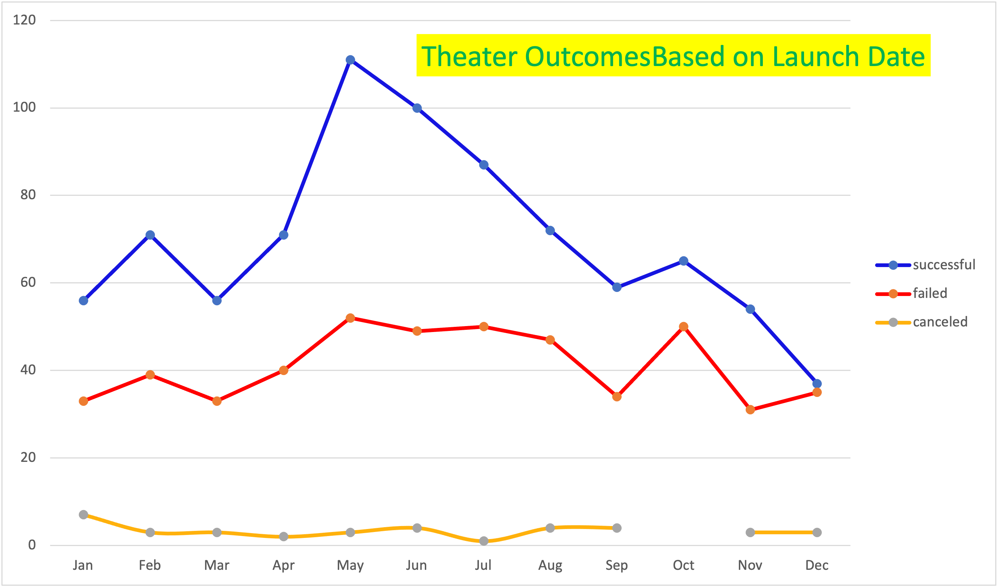
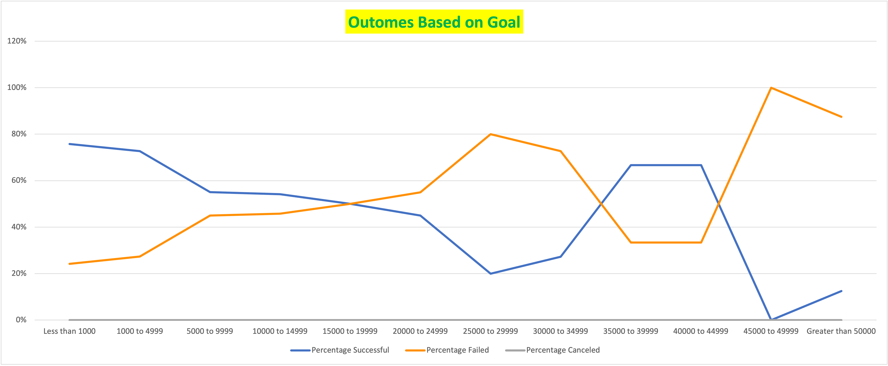

# Kickstarter Analysis Campaigns

## Overview of Project
Louise’s play Fever came close to its fundraising goal in a short amount of time. Now, she wants to know how different campaigns fared in relation to their launch dates and their funding goals. This Project will help Louise to organize and analyize data to make her crowdfundraising project successful.

## Purpose
To understand how different campaigns performed based on their launch dates and funding goals using data analytics.

## Analysis & Challenges encountered

- ### Outcomes Based on Launch Date
    Raw campaign data which was given in excel was used to analyze the fund raising outcome. There were many steps involved in sorting and organizing data to view the results.  
  - First step was to sort the data by year using the 'Date Created Conversion' column in excel file. In order to generate that data following formula was used.---

    `=year(S2)`
  - From the data sorted by year in the previous step, further pivot table was created to get successful, failed, or canceled project data for each month of the year. Pivot table was filtered on “Parent Category” and “Years.” “Parent Category” was further filtered to "Theater" from all the categories. Row labels are changed to display the year, and campaign outcomes are sorted in descending order from Row column.
  - A line chart is created showing number of successful, failed, or canceled projects by month sorting in decending order for Theater under the below title:
    - 

- Challenges that came during the Successful US Kickstarters and Failed US Kickstarters sheet were created. Filtering data was not done properly for outcome column and it resulted in wrong data in generated chart. To overcome this had to go through the whole module again figure out the error. While filtering columns or creating pivot chart we need to make proper selection to get the desired outcome.

- ### Outcomes Based on Goals

    Percentage of succesful, failed and canceled projects were calculated based on the funding goal amount.

    - `=COUNTIFS` and `=SUM()` formula were used to calculate the percentages and the total number of each projects.

    - A line chart graph is created to display the above data.

      - 

- Challenges that were faced during implementation of this exercise were:
  - creating a line chart based on criteria was difficult due to the selection of inappropriate columns in excel
  - applying correct criteria_range in countifs formula
    

## Results

- What are two conclusions you can draw about the Theater Outcomes by Launch Date?
  - Projects initiated in month of May and June had a high number of successful count.
  - Nearly, 70% of projects were successful in whole year.  

- What can you conclude about the Outcomes based on Goals?
  - Most successful projects were in the range between 1000 and 4999.
  - Any projects with the goal above 45000 had a less success ratio.

- What are some limitations of this dataset?
  - Demographic information can help further analyze which city or state had more successful projects.

- What are some other possible tables and/or graphs that we could create?
  - pivot tables using different criterias for parent/sub categories.
  - Pie chart, histogram charts can be used to analyze dataset.
