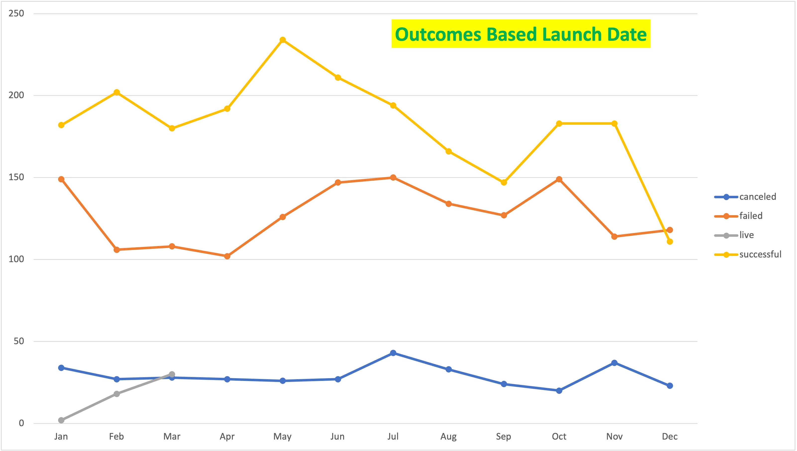

# An Analysis of Kickstarter Campaigns.
Performing analysis on Kickstarter data to uncover trends

# Kickstarter Analysis Campaigns

## Overview of Project
Louise’s play Fever came close to its fundraising goal in a short amount of time. Now, she wants to know how different campaigns fared in relation to their launch dates and their funding goals. This Project will help Louise to organize and analyize data to make her crowdfundraising project successful.

### Purpose
To understand how different campaigns performed based on their launch dates and funding goals using data analytics.

## Analysis and Challenges
Raw campiagn data which was given in excel was used to analyze the fund raising outcome.  There were many steps involved in sorting and organizing data to view the results.  
- First step was to sort the data by year using the 'Date Created Conversion' column in excel file. In order to generate that data following formula was used.---

    `=year(S2)`
- From the data sorted by year in the previous step, further pivot table was created to get successful, failed, or canceled project data for the months of the year from Row column and by filtering category to 'Theater'. 
- A line chart is created showing number of successful, failed, or canceled projects by month sorting in decending order under the below title:
    

## Challenges

  

### Analysis of Outcomes Based on Launch Date
contains a “Years” column, a pivot table filtered on “Parent Category” and “Years.” ✓“Parent Category” is filtered on a different category or shows all the categories. ✓ONE of the THREE pivot table fields for columns, rows, and values are correct, row labels are changed to display the year, and campaign outcomes are sorted in descending order. ✓A line chart is created but doesn’t match the solution file, it may have a title and is saved as a PNG file.

### Analysis of Outcomes Based on Goals

### Challenges and Difficulties Encountered

## Results

- What are two conclusions you can draw about the Outcomes based on Launch Date?

- What can you conclude about the Outcomes based on Goals?

- What are some limitations of this dataset?

- What are some other possible tables and/or graphs that we could create?
